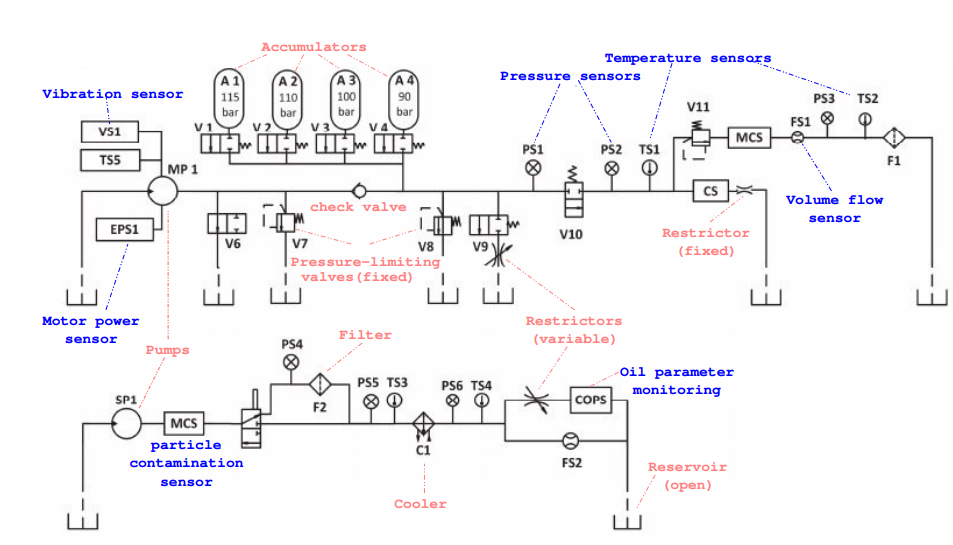

# Project README

## 🚀 Project Overview
This project involves analyzing hydraulic test rig data to monitor internal pump leakage. The test rig consists of a primary working circuit and a secondary cooling-filtration circuit connected via the oil tank. The system cyclically repeats constant load cycles (duration 60 seconds) and measures process values such as pressures, volume flows, and temperatures while varying the condition of four hydraulic components (cooler, valve, pump, and accumulator).

### 📊 Understanding the Dataset
#### 🛠️ Data Collection
The dataset was obtained experimentally using a hydraulic test rig that measures various process values during constant load cycles. The data is collected at a uniform sampling rate of 100 Hz and includes measurements from several sensors.

## 📑 Attribute Information
The dataset contains raw process sensor data with rows representing the cycles and columns representing data points within a cycle. The sensors involved are shown in the diagram below:

## 🎯 Objective
The goal of this analysis is to monitor internal pump leakage (MP1), classified into three categories:

0: No leakage
1: Weak leakage
2: Severe leakage

The target condition values are cycle-wise annotated in the `profile.txt` file.

### 📊 Creating Statistical Features
To handle the multiple dimensions of the data, statistical features were created, transforming the time series into a single dimension. This process allows for a more straightforward analysis and visualization of the data. The image below illustrates this transformation for one of the sensors:

## Project Structure

- **data/**: Contains the raw and processed data.
  - **processed/**: Processed data.
    - `etl/`: ETL processed data.
    - `features/`: Feature engineered data.
  - **raw/**: Raw data files.
- **docs/**: Documentation files.
- **figures/**: Visualizations and figures.
- **notebooks/**: Jupyter notebooks for data analysis and exploration.
- **src/**: Source code and scripts.
  - **models/**: Saved models.
  - **utils/**: Utility scripts and modules.
  - `1.ETL.py`: ETL process script.
  - `2.EDA.py`: EDA script.
  - `3.Modelling.py`: Model training and evaluation script.
  - `4.Predict.py`: Model prediction script.
- **README.md**: Project overview and instructions.
- **requirements.txt**: Python dependencies required to run the project.

## Data Availability and References

Data available at https://archive.ics.uci.edu/ml/datasets/Condition+monitoring+of+hydraulic+systems#

References:

[1] Helwig, Nikolai, Eliseo Pignanelli, and Andreas Schütze. "Condition monitoring of a complex hydraulic system using multivariate statistics." 2015 IEEE International Instrumentation and Measurement Technology Conference (I2MTC) Proceedings. IEEE, 2015.